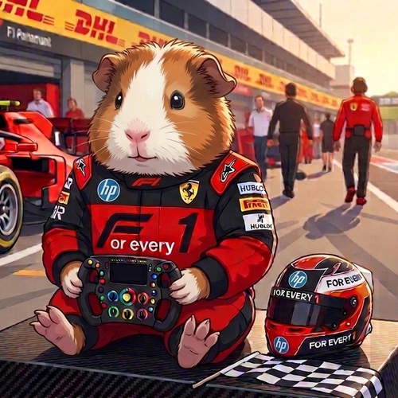
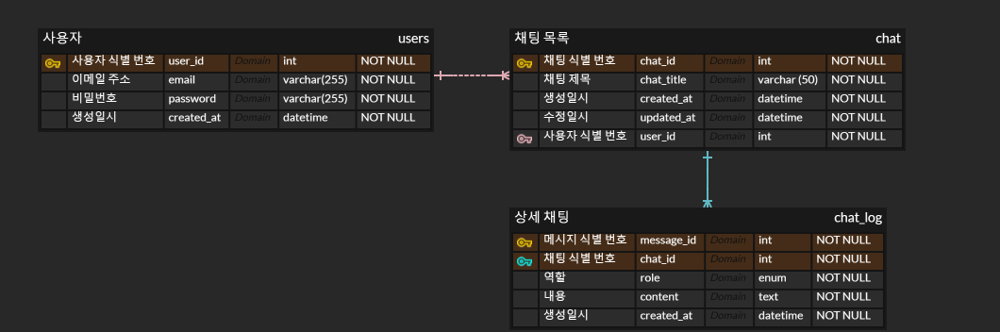
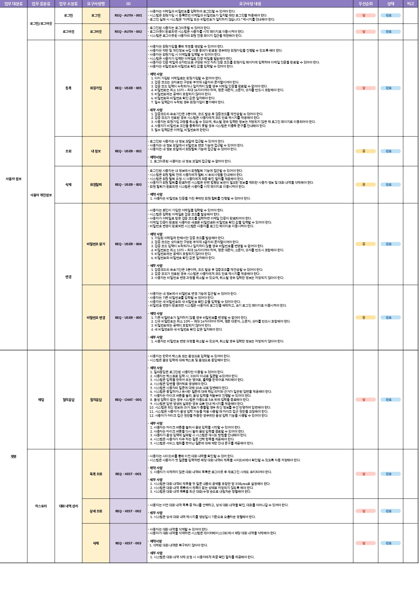

# SK네트웍스 Family AI 캠프 24기 4차 프로젝트
## 🏎️ F1을 쉽게！For every1

  
  

## 1. 팀 소개 
  > F1에 익숙한 시선 1개와 낯선 시선 4개가 만나, 어렵고 복잡한 정보를 쉽고 친절하게 🔃새로고침하는 팀 **F5** 입니다❗
  
<table>
  <tr>
    <th width="200">김민준</th>
    <th width="200">김유진</th>
    <th width="200">박영훈</th>
    <th width="200">전윤우</th>
    <th width="200">최현진</th>
  </tr>
  <tr>
    <td align="center" width="200">
      
    </td>
    <td align="center" width="200">
      
    </td>
    <td align="center" width="200">
      
    </td>
    <td align="center" width="200">
      
    </td>
    <td align="center" width="200">
      
    </td>
  </tr>
<tr>
    <td align="center" width="200">
      
    </td>
    <td align="center" width="200">
      
    </td>
    <td align="center" width="200">
      
    </td>
    <td align="center" width="200">
      
    </td>
    <td align="center" width="200">
      
    </td>
  </tr>
</table>

---

# 2. 프로젝트 개요

## 2-1. 프로젝트 명

- Forevery1 (For every One)

## 2-2. 프로젝트 소개

> F1 입문자를 위해 어려운 용어와 복잡한 규정을 쉽게 설명해주는 **한국어 기반 F1 전문 챗봇**입니다. 사용자의 질문 의도에 따라 규정집, 용어집, 과거 기록, 라운드별 경기 정보 등을 바탕으로 적절한 답변을 제공할 수 있도록 LLM 챗봇을 구현했습니다.
> 

## 2-3. 프로젝트 필요성(배경)

> 최근 국내에서 F1 경기에 대한 관심과 팬 유입이 증가하고 있지만, 입문자가 처음 접하기에는 F1의 용어와 규정이 매우 어렵고 복잡합니다.
> 
> 특히, 규정은 매년 개정되기 때문에 단순 검색만으로는 정확한 정보를 이해하기 어렵습니다.
>
> 
> 더불어, 작년 F1 더 무비 개봉 이후, F1 규칙에 대한 수요가 증가했지만 이후 줄어드는 모습을 볼 수 있습니다.
> 
> 쿠팡플레이의 윤재수 F1 해설위원 또한 "국내엔 체계적으로 설명해 주는 자료나 교육 프로그램이 거의 없어 진입장벽이 높다"고 지적한 바 있습니다. ([출처](https://v.daum.net/v/xKESU0PKEy))
>
> 
> F1에 대한 국내 관심과 시장 성장 가능성 역시 인천시의 F1 그랑프리 유치 추진을 통해 확인할 수 있습니다. 인천시는 대회 개최 시 관광수익 약 5,800억 원과 대규모 국내외 관광객 유입을 예상하고 있으며, 이는 F1이 국내에서도 스포츠를 넘어 관광·도시 브랜딩·엔터테인먼트 콘텐츠로 확장될 가능성이 있음을 보여줍니다. ([출처](https://www.segye.com/newsView/20260416525704?OutUrl=naver))
>
> 이에 따라, 입문자도 쉽고 빠르게 F1 정보를 이해할 수 있도록 돕는 챗봇의 필요성을 느껴 본 프로젝트를 기획하게 되었습니다.

<table>
  <tr>
    <td align="center" width="50%">
       
      출처: <a href="https://v.daum.net/v/HQc9YRwaEp">gpkorea 기사</a>
    </td>
    <td align="center" width="50%">
       
      출처: <a href="https://digitalchosun.dizzo.com/site/data/html_dir/2026/03/06/2026030680090.html"> 디지틀조선일보 기사</a>
    </td>
  </tr>
</table>

 

   
  출처: <a href="https://www.chosun.com/sports/sports_general/2026/03/05/INS5ESTOJBEW3CJ3EC3RFBRPXY/">조선일보 기사</a>

# 3. 기술 스택

### 🛠️ Backend

| Category | Stack |
| --- | --- |
| Language |  |
| Framework |  |
| STT / TTS |   |
| Deployment |  |
| DataBase |   |

### 🖥️ Frontend

| Category | Stack |
| --- | --- |
| Language |  |
| Markup / Style |   |

### 🧠 AI / Model Server

| Category | Stack |
| --- | --- |
| Server |   |
| LLM API |   |
| RAG Framework |  |
| Embedding |  |
| Vector DB |  |

### ⚙️ Infrastructure & Tools

| Category | Stack |
| --- | --- |
| Server |   |
| Database |  |
| Collaboration | |
| Design | |

# 4. 모델 개선

<table>
  <tr>
    <td width="50%" align="center" valign="top">
      <h2>개선 전</h2>
      
    </td>
    <td width="50%" align="center" valign="top">
      <h2>개선 후</h2>
      
    </td>
  </tr>
  <tr>
    <td width="50%" valign="top">
      기존 플로우차트는 GPT-4o-mini 모델이 에이전트 역할을 하여 규정 문서 기반 RAG와 경기 기록 조회 중 하나를 선택하는 구조였습니다. 문서가 영어로 되어 있어 한국어 번역 후 Reranker Model을 거쳐 sLM으로 답변을 생성하였으나, 이 구조가 비효율적이라고 판단하여 개선하였습니다.
    </td>
    <td width="50%" valign="top">
      답변 생성 모델을 sLM에서 GPT-4.1-nano로 교체하였으며, 비용에 비해 유사하거나 그보다 더 좋은 품질의 답변을 얻을 수 있었습니다. 또한 벡터 기반 유사도 검색만 사용할 경우 핵심 키워드 검색이 미흡한 문제가 있어, 키워드 검색과 벡터 검색을 결합한 Hybrid Search를 도입하였습니다.
    </td>
  </tr>
</table>

# 5. ERD 및 시스템 구성도

## 5-1. 시스템 구성도

> 모델 서버는 FastAPI를 이용하여 RunPod 추론 서버를 구축하였습니다. 백엔드는 Django Framework를 기반으로 Gunicorn을 앱 서버로 사용하였으며, STT/TTS 연동 과정에서 http와의 연결이 안 되어 GINX를 대신해 Ngrok을 웹 서버로 활용하였습니다. 최종적으로 AWS를 이용하여 배포하였습니다.
> 

## 5-2. ERD

> 사용자와 채팅목록은 사용자 식별 번호를 PK로 하고, 채팅 식별 번호를 FK로 하는 비식별 관계로 설정하였고, 채팅목록과 상세 채팅은 사용자 식별 번호를 PK로, 메시지 식별 번호와 채팅 식별 번호를 복합키로 적용하는 식별 관계로 설정하였습니다.
> 

# 6. 요구사항 정의서

> 요구사항 정의서는 크게 사용자 정보와 챗봇으로 나눠서 작성하였습니다. 사용자 정보는 로그인/로그아웃 등록, 조회, 삭제 등이 해당하는 사용자 개인정보 핸들링, 챗봇에서는 채팅과 히스토리로 다시 구분하여 작성하였습니다.
> 
- 요구사항 정의서
    
    

    

# 7. 화면설계서

> 시작 페이지에서는 로그인과 회원가입 기능을 모달 방식으로 처리하여 페이지 이동 없이 동일한 화면에서 이용할 수 있습니다. 회원가입 완료 후에는 자동으로 메인 화면으로 전환되지 않으며, 로그인 페이지로 돌아가 별도로 로그인을 진행해야 합니다.  

> 로그인 후 진입하는 메인 화면에서는 첫 대화 시작 시 추천 질문 3개가 자동으로 표시되며, 해당 질문을 클릭하면 챗봇이 자동으로 답변을 제공합니다. 추천 질문은 첫 대화에서만 표시되며, 이후부터는 텍스트 입력창에 직접 질문을 입력하여 전송 버튼혹은 엔터를 통해 대화를 진행할 수 있습니다. STT/TTS 기능은 마이크 버튼을 통해 음성 입력을 인식하여 질문을 전송하는 방식으로 동작합니다.  

> 화면 좌측에는 대화 히스토리가 표시되며, 히스토리 상단의 New Chat 버튼을 통해 새로운 대화를 생성할 수 있습니다. 환경설정에서는 체크박스를 통해 히스토리를 전체 삭제할 수 있으며, 비밀번호 변경 및 회원 탈퇴 기능도 제공됩니다. 또한 화면 좌측 상단에는 사이드바를 열고 닫을 수 있는 토글 버튼이 위치합니다.  

# 8. WBS

# 9. 테스트 계획 및 결과 보고서

> 챗봇의 원활한 서비스 제공을 위해 요구사항 명세서를 기반으로 단위 테스트를 진행하였습니다. 테스트는 총 3인이 참여하였으며, 3인의 결과가 모두 Pass인 경우 테스트를 완료로 처리하였습니다. 한 명이라도 실패할 경우 오류를 수정한 후 테스트를 다시 진행하였으며, 3인 모두에게서 Pass가 나올 때까지 이 과정을 반복하였습니다.

<b>테스트 개요 및 계획</b>

<b>테스트 수행</b>

<b>테스트</b>

    

<b>결과</b>

# 10. 수행결과(테스트/시연 페이지)

> [https://sniff-tubby-trustful.ngrok-free.dev/](https://sniff-tubby-trustful.ngrok-free.dev/)
> 

# 11. 한 줄 회고

**김민준** 
> 여러가지 시행착오도 굉장히 많이 겪어보고,풀스택 배포까지 전 과정을 직접 경험해본 것은 큰 경험이었던 것 같습니다. 특히 AWS EC2와 RDS 연동, 그리고 Docker를 직접 만지면서 배포 환경을 구성해본 경험은 이전 프로젝트에서는 해보지 못했던 부분이라 더욱 값졌습니다. 그리고 AI 활용을 줄이고 이해를 하고 활용을 하는 방향으로 해서 전 프로젝트들 보다는 아쉬움이 적었던 것 같습니다. 하지만 AI 활용의 빈도는 여전히 높았지만 시간적 압박 속에서 이해보다 결과를 우선시하게 되는 순간들이 종종 있었습니다. 그렇지만 이전 프로젝트에서의 AI 활용하는 방식보다 이해를 하면서 프로젝트를 진행을 해서 어떤 흐름으로 동작하는지를 파악하려는 노력이 늘었던 것 같습니다.  

**김유진** 
> 이전 프로젝트에서 아쉬웠던 아키텍처 이해도를 팀원들과 사전에 공유해, 원활한 서비스가 가능했습니다. 더불어, 요구사항 명세서와 화면 설계서를 미리 팀원들과 충분히 공유하는 시간을 가진 덕분에 이전 프로젝트보다 뚜렷한 방향성을 가지고 진행한 점이 좋았습니다. 다만, 모델 개선에 있어 변환한 Markdown 파일을 재검수해 RAG 정확도 자체는 높였으나, 모델의 할루시네이션을 조금 더 명확히 개선하지 못한 점이 아쉽습니다. 추후에는 더 고품질의 데이터를 마련해 모델 답변의 정확도를 높이기 위한 파인튜닝을 재시도하겠습니다.  

**박영훈** 
> 이번 F1 입문자의 진입장벽을 낮추기 위한 챗봇을 기획하게 되면서, 기획에 있어서 기술 구현만을 고려하는 게 아니라 수요자의 조건에 충족하여 쉽게 이해할 수 있는 서비스 경험의 중요성을 배울 수 있었습니다.  

**전윤우** 
> 이번 프로젝트에서 주로 RAG 개선을 맡아서 진행하였는데, 어떻게 해야 개선이 될 수 있을지 고민하는 과정에서 실제로 어떤 부분을 변경하였을 때 개선이 되는 것을 확인할 수 있었습니다. 그런 부분에 있어 스스로 발전했다고 생각합니다. 그러나 백엔드와 프론트엔드에는 많은 참여를 하지 못해 아쉬운 부분이 있고, 다음 프로젝트를 할 때에는 그런 부분을 좀 더 시도해보고자 합니다. 최종적으로 제가 서버를 배포하지는 않았지만 서버 배포를 시도하는 과정에서 AWS EC2, RDS 연동, Docker 등을 직접 사용해보면서 배포 환경을 구성해보기도 하였고 배운 내용을 조금 더 이해해볼 수 있었던 시간이었습니다.  

**최현진** 
> 이번 프로젝트를 통해 구현 단계에 앞서 기획 단계에서 서비스의 설계를 탄탄히 해야 한다는 점을 절실하게 실감했습니다. 실시간 경기 관련 질의 시 에이전트가 제대로 작동하지 않아 API에서 정보를 제대로 반환 받지 못한 것에 아쉬움이 크게 남습니다. 또한, 일부 화면에 대해서 화면 설계서대로 완벽하게 구현하지 못한 점과 음성 입력의 정확도가 낮은 점이 아쉽습니다. 이러한 부분들은 차후 개선을 통해 실제 서비스를 F1 시청자에게 공유하여 피드백을 받아보고 싶습니다.  
